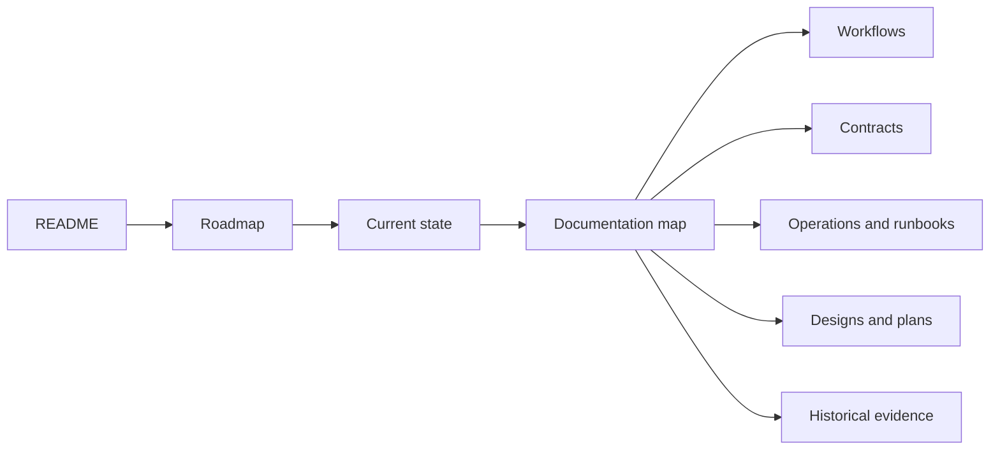

# AI Booster Kit Platform

AI Booster Kit is a modular, human-centred platform for deliberate
agent-driven work. It helps people and teams choose, tune, validate, and reuse
the right Agent or Multi-Agent capability for the work at hand—without making
Agent assistance mandatory.

## Start here

Follow this order when entering the repository:

1. [Roadmap](docs/project/roadmap.md) — the platform vision, full life journey,
   capability tracks, and milestone sequence.
2. [Current state](docs/project/current-state.md) — what is true for the active
   delivery branch, including validation, limits, and the next bounded action.
3. [Documentation map](docs/project/documentation-map.md) — where to find the
   canonical workflow, contract, operation, runbook, design, and history
   sources.

The roadmap explains **where the platform is going**. The current-state file
explains **where delivery is now**. The documentation map explains **where the
details live**. No page repeats the complete content of another page.

## Repository shape

| Area | Canonical purpose |
| --- | --- |
| [`workflows/`](workflows/) | One canonical workflow specification per workflow. |
| [`contract/`](contract/) | Shared contracts, lifecycle rules, capability boundaries, and artifact templates. |
| [`docs/project/`](docs/project/) | Roadmap, current delivery routing, and documentation navigation. |
| [`docs/operations/`](docs/operations/) | Active operating guidance and host-specific procedures. |
| [`docs/runbooks/`](docs/runbooks/) | Repeatable operational procedures and readiness checks. |
| [`docs/superpowers/`](docs/superpowers/) | Reviewed designs and implementation plans. |
| [`docs/history/`](docs/history/) | Historical evidence that is not active runtime context. |
| [`src/`](src/) | Host-agnostic runtime, Controller, evidence, and orchestration code. |
| [`website/`](website/) | Public-facing product surface. |

## Product direction

The bounded Agent Framework Library and Recipe Controller foundation, M2
activation boundary, and M3 context/session slice are implemented within local
recommendation-only scope. The next bounded delivery is M4 design and
Codex-first host-conformance planning. Automatic Jira–GitHub–Confluence
synchronization remains an optional later capability.

Read the [roadmap](docs/project/roadmap.md) for the complete reasoning and
sequence. Read the [Team Delivery Loop](workflows/team-delivery-loop.md) for
the canonical team workflow.

## Working principles

- Human ownership and explicit consent remain at the centre.
- Agent assistance is optional; User-owned skills and tools remain valid.
- Evidence, `UNKNOWN` states, relations, and rollback boundaries are explicit.
- One framework changes at a time; prior setup is preserved for recovery.
- Compact session state is preferred over transcript and artifact accumulation.

## Status

This repository is actively evolving. The [current state](docs/project/current-state.md)
is the operational, routing-only source; Git history and the linked PR provide
the publication trail.

