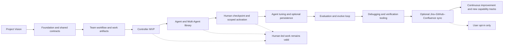
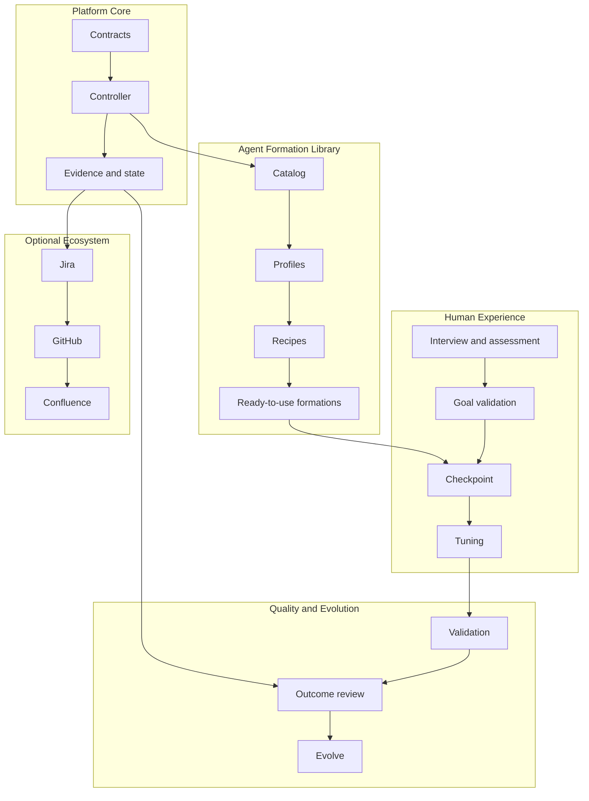
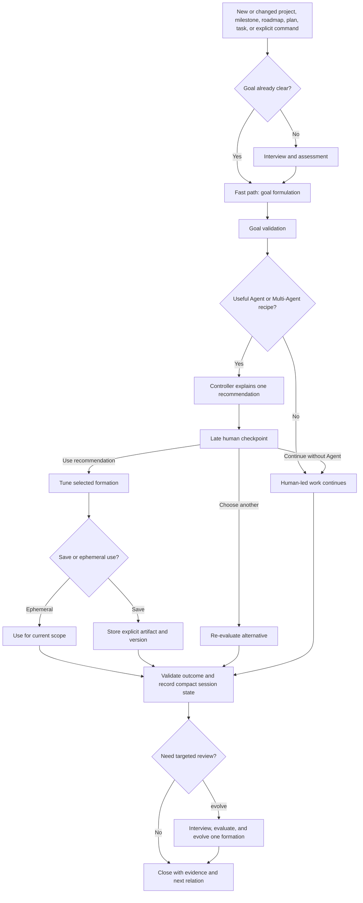
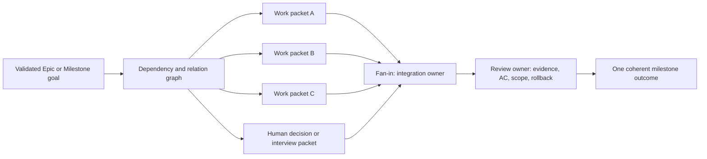

# AI Booster Kit Platform Roadmap

> Durable capability roadmap for the AI Booster Kit platform. It describes the
> intended journey from the first useful building block to the complete,
> continuously improving product surface. Operational delivery status belongs
> in [current-state.md](current-state.md); this document is not a changelog or
> an authorization to perform external writes.

## 1. Platform direction

AI Booster Kit is a modular, human-centred capability platform for deliberate
agent-driven work. It gives a team a coherent field of reusable contracts,
workflows, tools, and ready-to-use Agent or Multi-Agent formations without
forcing one methodology, one orchestration pattern, or one integration path.

The platform must remain:

- **Human-owned:** the User owns the outcome, scope, and final consent.
- **Optional:** Agent assistance, framework activation, saving, persistence,
  and cross-system synchronization are selectable capabilities.
- **Evidence-first:** facts, decisions, unknowns, deviations, and outcomes are
  recorded against the active canonical contract.
- **Adaptable:** every formation can be tuned, evaluated, evolved, replaced, or
  skipped without silently changing another formation.
- **Recoverable:** the previous setup remains available for rollback; one
  framework is changed at a time.
- **Team-compatible:** the same platform supports solo work and 3–6 people
  working in parallel with explicit ownership and dependency handling.

The long-term goal is not “more agents”. It is a reliable capability field in
which the Controller recognizes the work situation, explains a useful recipe,
and leaves the User in control of whether and how that recipe is used.

## 2. The complete platform journey

The journey is capability-led rather than date-led. A capability becomes
available when its contract, implementation, evidence, and recovery boundary
are reviewable. A later capability may be usable independently, but it must not
become an implicit prerequisite for earlier human-led work.

The synchronization track is part of the full platform life journey and may
eventually become a deep core capability. It is deliberately not an early gate:
the Agent/Multi-Agent library, Controller reasoning, activation boundary, and
evidence model must provide direct functional value first.

## 3. How to read status and progress

Roadmap status is capability-level. It is not proof of a remote merge, a live
connector result, or a production deployment. For operational truth, read
[current-state.md](current-state.md) and then the source-native evidence named
there.

The roadmap uses the repository evidence vocabulary:

| State | Meaning in this roadmap |
| --- | --- |
| `READY` | The capability contract and required evidence support the stated use within scope. |
| `COMPLETE_WITH_LIMIT` | A useful bounded slice exists, but an explicit boundary remains. |
| `PARTIAL` | Some pieces exist; the capability is not yet a coherent user-facing slice. |
| `NOT READY` | The intended slice is defined, but a required contract, input, or proof is missing. |
| `NOT EXECUTED` | The capability is intentionally future work, with no implementation claim. |
| `UNKNOWN` | Evidence is insufficient; it must not be treated as safe or complete. |
| `STOPPED` / `BLOCKED` | Work cannot proceed within the current scope or authority boundary. |

The views below answer different questions:

- **Capability journey:** what the platform becomes over its lifetime.
- **Now / Next / Later:** what to build in a useful order.
- **Maturity matrix:** which independent product track is progressing.
- **Milestone gates:** what evidence is needed before a capability is promoted.

## 4. Current capability map

This is a local, repository-grounded planning view. `COMPLETE_WITH_LIMIT` means
the bounded slice is present, not that the complete product vision is finished.

| Capability slice | Status | Local evidence | Boundary or next gate | Relation |
| --- | --- | --- | --- | --- |
| Shared vocabulary and team contract | `COMPLETE_WITH_LIMIT` | `NOTES.md`, `contract/team-contract.md` | Keep terminology canonical and avoid duplicate status documents. | `implements` Vision; `supports` all tracks |
| Team Delivery Loop | `COMPLETE_WITH_LIMIT` | `workflows/team-delivery-loop.md` | Continue validating parallel ownership, fan-in, and rollback behavior. | `implements` Roadmap; `supports` Epic/Milestone delivery |
| Host-agnostic contracts and projections | `COMPLETE_WITH_LIMIT` | `contract/`, `src/contract/`, host adapter contracts | Prove conformance independently per host; do not infer security from host behavior. | `related_to` every execution track |
| Controller recommendation MVP | `COMPLETE_WITH_LIMIT` | `src/controller/`, `src/cli.ts`, formation catalog, scenario recommendation, two READY scenario recipes, and focused tests | Keep the ready Quick Task, validation, and refinement paths stable; complete the remaining scenario recipes and profile-specific output contracts separately. | `implements` Controller layer |
| Human Checkpoint and Activation Intent | `COMPLETE_WITH_LIMIT` | `src/controller/checkpoint.ts`, `choice.ts`, `resolve.ts`, focused tests | Keep the checkpoint late, explicit, and side-effect-free until activation is separately authorized. | `depends_on` Controller; `protects` User consent |
| Quick Task Clarifier/Validator recipe | `COMPLETE_WITH_LIMIT` | `contract/agent-library/quick-task-clarifier-validator.md` | Add more ready-to-use formations without changing this recipe implicitly. | `implements` first library entry |
| Quick Task Activation Package | `COMPLETE_WITH_LIMIT` | `src/controller/activation-package.ts`, `src/cli.ts`, focused Controller tests, and the approved design/plan | Preserve the ephemeral, host-agnostic boundary; design host adaptation/execution or explicit package saving separately. | `depends_on` Human Checkpoint |
| Agent Framework Library and Recipe Controller v1 | `NOW` / `NOT READY` | M1-A catalog/validator, M1-B scenario recognizer/recommendation, and READY validation/refinement recipes with profile contracts provide the bounded foundation | Complete research, implementation, and debugging recipes plus the remaining readiness/negative-path evidence before promoting the library. | `depends_on` Controller; `enables` all later Agent tracks |
| Activation, tuning, save-or-ephemeral choice | `NEXT` / `NOT EXECUTED` | Human checkpoint contract defines the boundary | Add explicit activation executor, tuning inputs, artifact lifecycle, and rollback. | `depends_on` Library v1 |
| Compact session state and optional storage | `NEXT` / `NOT EXECUTED` | Session-state principles are defined in the workflow contract | Persist only resumable state, never a full transcript by default. | `supports` activation and evolve |
| Evaluation and `evolve` review | `LATER` / `NOT EXECUTED` | Accepted product direction and event vocabulary | Evaluate session outcomes and repeated `UNKNOWN` or +/- events; evolve one formation at a time. | `validates` active setup |
| Debugging and iterative verification tooling | `LATER` / `NOT EXECUTED` | Product vision and debugging workflow direction | Build modify–run–verify probes and zero-configuration local context injection. | `supports` implementation and validation |
| Jira–GitHub–Confluence lifecycle sync | `LATER` / `NOT EXECUTED` | Existing mapping/readiness contracts | Add only after internal contracts, evidence, consent, and read-back are strong; User opt-in. | `depends_on` Library, Controller, evidence, and authority model |

The `NOW` item is intentionally the Agent Framework Library and Recipe
Controller, not automatic cross-system synchronization. The library creates
directly usable product value: a team can choose a suitable formation for
refinement, research, planning, debugging, validation, or implementation before
any connector is involved.

## 5. Product tracks and maturity

The platform is a product palette. Tracks can mature independently and may be
combined through explicit recipes, but no track silently activates another.

| Track | Foundation | Mature capability | Long-term direction |
| --- | --- | --- | --- |
| Platform Core | Shared contracts and Controller MVP | Scenario-aware recommendation with evidence and stop states | Stable extension surface for new tools and hosts |
| Agent Formation Library | One light Quick Task recipe | Strongly characterized light/heavy formations across scenarios | A searchable, hashable, versioned capability palette |
| Human Experience | Goal validation and late checkpoint | Choice, tuning, save/ephemeral use, and transparent risk | Low-friction assistance without over-push or lock-in |
| Quality and Evolution | Explicit AC/evidence and unknowns | Session outcome and +/- event evaluation | Targeted `evolve` with measurable improvement and rollback |
| Optional Ecosystem | Mapping and readiness contracts | Bounded, read-back-verified lifecycle projection | Optional agent-driven Jira/GitHub/Confluence synchronization |

## 6. Common workflow and fast path

All three workflow modes—human-led, human + Agent, and solo Agent-assisted—use
the same conceptual base. The User may shorten the path when the goal is already
clear.

The three checkpoint mechanics are intentionally simple and neutral in wording:
accept the recommendation, select a better alternative, or continue without
Agent assistance. A User-owned skill or tool may be used instead. If the choice
materially weakens safety, evidence, reproducibility, or rollback, the system
must explain the consequence and request clear acknowledgement.

## 7. Agent Framework Library v1 — the next milestone

This is the first major product milestone after the Controller MVP. It creates
the reusable “album” from which future recipes can be selected.

### 7.1 Required library characteristics

Every formation entry must have a strong, explicit identity rather than being a
generic prompt bundle:

| Dimension | Required definition |
| --- | --- |
| Scenario | Development, design, research, debugging, validation, planning, or another bounded use case. |
| Weight | Light, medium, or heavy operational footprint. |
| Complexity | Expected task, coordination, state, and recovery complexity. |
| Topology | Single agent, sequential, parallel fan-out/fan-in, handoff, graph, supervisor, swarm, or another declared pattern. |
| Roles | Persona, planner, decomposer, executor, tool agent, critic, validator, memory/context manager, or human checkpoint role. |
| Required input | Minimum DoR: goal, scope, context, constraints, and required evidence appropriate to the formation. |
| Expected output | DoD: artifact, decision, implementation, report, validation result, or explicit stop. |
| Acceptance and evidence | AC plus the evidence transport, provenance, and confidence required to accept the result. |
| Relations | Vertical and horizontal links such as `implements`, `depends_on`, `blocks`, `validates`, `parallel_to`, and `related_to`. |
| Prerequisites | Required graph/flow mapping, routing map, tool access, context artifact, or human decision. |
| Recovery | Rollback boundary, preserved prior setup, and conditions that force `STOPPED` or `UNKNOWN`. |
| Identity signal | Stable version, mapping/index key, and pattern signature so repeated situations do not produce an untracked duplicate recommendation. |

### 7.2 Weighted preparation depth

The Controller should scale preparation to the work rather than forcing every
User through the largest process:

| Work level | Preparation | Minimum contract |
| --- | --- | --- |
| Quick Task | Minimal | Short DoR, DoD, AC, evidence, and relation statement; a `goal.md`-like goal artifact may be enough. |
| User Story | Bounded but functional | Detailed acceptance model, required inputs/outputs, evidence, and relation links. |
| Epic / Milestone | Full planning support | Dependency, evidence, and relation graph; optional interview/evaluation; explicit parallel ownership for 3–6 contributors. |

A heavy hierarchical formation may require a graph or connection/flow mapping
artifact before it can be recommended as `READY`. A light parallel research
formation may require only a compact goal artifact and a clear expected output.
The prerequisite is a reasoned contract, not a universal mandatory template.

### 7.3 v1 acceptance gate

The library milestone can move from `NOT READY` to `READY` only when:

1. the catalog has the first light Quick Task formation, READY validation and
   refinement formations, and bounded candidates for research, implementation,
   and debugging;
2. the Controller can classify a request, explain its recommendation, state
   missing prerequisites and `UNKNOWN` evidence, and avoid recommendation when
   the fit is not supported;
3. the human checkpoint preserves the three choices and explicit consent for
   materially adverse decisions;
4. a recommendation carries a stable identity/index signal and does not mutate
   another framework implicitly;
5. each formation declares input, output, AC/evidence, relations, and rollback;
6. tests cover positive, mismatch, missing-input, unsafe, unknown, duplicate,
   and no-Agent paths;
7. the result is reviewable as a contract, implementation, and evidence-backed
   diff.

## 8. Parallel team delivery model

The platform is intended to reduce coordination load for a real team, not to
replace team ownership. Epic and Milestone work may fan out, but each packet
must declare its owner, inputs, outputs, relations, and integration point.

The Controller or a selected formation may help decompose and coordinate this
work, but it must surface dependencies rather than hide them. Parallel work is
valid only where packet boundaries are explicit; shared mutable files,
ambiguous ownership, or an unresolved dependency must be visible as a stop or
unknown condition.

## 9. Milestone sequence: Now, Next, Later

This sequence is intentionally outcome-oriented and has no calendar promise.

### Now — M1: Agent Framework Library and Recipe Controller v1

Create the catalog and recipe contract, define light/heavy dimensions and
prerequisites, add scenario recognition, and produce explainable
recommendations with a stable identity signal.

**Exit evidence:** library contract, first catalog entries, recommendation
fixtures, negative/unknown-path tests, and a reviewed implementation diff.

### Next — M2: Activation and agent tuning boundary

Turn a User-approved intent into a scoped, host-agnostic activation/tuning
artifact. Keep activation, generated files, saved packages, and external actions
behind explicit boundaries.

**Exit evidence:** activation contract, one-at-a-time mutation rule, preserved
prior setup, rollback test, and explicit save-versus-ephemeral behavior.

### Next — M3: Compact session state and optional storage

Allow a paused session to resume after days or weeks without accumulating dirty
files or importing a full transcript into active context. Store only the
canonical contract reference, goal, decisions, evidence pointers, unknowns,
deviations, progress, and next action.

**Exit evidence:** resumable session-state schema, retention rule, redaction
behavior, stale-state detection, and a successful resume/stop test.

### Later — M4: Evaluation and `evolve`

Evaluate the session result and positive/negative events, including repeated
`UNKNOWN` outcomes. A targeted `evolve` review may tune one formation at a time;
no implicit multi-framework modification is allowed.

**Exit evidence:** outcome model, improvement signal, rollback snapshot, and a
before/after evaluation that demonstrates a meaningful change or records `NO
EVOLUTION` with a tooling/setup diagnosis.

### Later — M5: Debugging and iterative verification toolkit

Provide methodology-driven modify–run–verify loops, log probes, debugging
strategies, and zero-configuration local runtime context injection to shorten
the guess–verify loop to observe–fix.

**Exit evidence:** reproducible probe contract, safe context boundary, failure
classification, and tests for stale, missing, malformed, and unsafe context.

### Later — M6: Optional Jira–GitHub–Confluence lifecycle sync

Implement the mapper and read/write projections that surface documentation,
structural elements, context-preserving flows, context-generating flows,
practices, and decision points across the lifecycle.

**Exit evidence:** exact target and authority contracts, bounded read path,
allowlisted write path, native link resolution, post-write read-back, duplicate
rule, audit trail, and explicit User opt-in. Connector availability alone is not
evidence of authority or correctness.

### Continuous — M7: Capability expansion and quality evolution

Add new formations, host projections, debugging strategies, and sync adapters
only as independently reviewable slices. Reuse the library contract and
pattern/index signal; never grow an unbounded collection of undocumented
artifacts.

## 10. Canonical artifact and state rules

The roadmap follows the project’s document discipline:

- one canonical workflow specification per workflow under `workflows/`;
- one compact session-state per run, not a full transcript;
- the Controller reads the active canonical contract first;
- decisions, evidence, unknowns, deviations, and progress attach to that
  contract;
- briefs, checklists, and reports are derived and disposable;
- historical material is not automatically active Agent context;
- `plan.md`, `task.md`, `context.md`, `review.md`, `Milestone.md`, `Epic.md`,
  or `Task.md` are created separately only when they have an independent owner,
  lifecycle, and contribution to the Vision or Roadmap.

The roadmap itself is a strategic source, not a replacement for a workflow
contract or session state. A roadmap item becomes executable only through a
scoped design, acceptance criteria, implementation plan, and reviewable result.

## 11. Change, risk, and rollback policy

Roadmap evolution is expected, but it must be deliberate:

1. keep the previous setup before tuning or replacing a formation;
2. change one framework or recipe at a time;
3. record the trigger, evidence, decision, unknowns, and expected benefit;
4. require explicit consent when a choice materially weakens the result;
5. preserve a stable mapping/index/pattern signal for search and future
   recommendation quality;
6. if evidence is insufficient, report `UNKNOWN`, not safe;
7. if repeated use produces `UNKNOWN` without improvement, evaluate the tooling
   setup rather than blaming the User or silently widening the workflow;
8. promote a capability only after its DoR, DoD, AC, evidence, relation, and
   rollback boundary are demonstrated.

## 12. Navigation and current tracking

- [Current delivery state](current-state.md) — operational routing, branch,
  validation, limits, and next bounded action.
- [Team Delivery Loop](../../workflows/team-delivery-loop.md) — canonical team
  workflow and relation vocabulary.
- [AI Booster Kit Vocabulary](../../NOTES.md) — compact shared terminology.
- [Quick Task Clarifier and Validator](../../contract/agent-library/quick-task-clarifier-validator.md) — first library contract.
- [Capability matrix](../../contract/capability-matrix.md) — capability and host
  projection boundaries.

The next concrete delivery slice is **M1: Agent Framework Library and Recipe
Controller v1**. The platform is useful already, but it is intentionally not
declared finished: the roadmap keeps the next functional capability visible
without turning future options into mandatory process.

