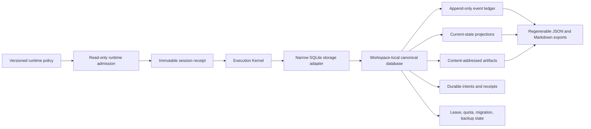

# Transactional persistence and stable runtime binding design

**Status:** approved design; implementation not started

**Approved:** 2026-08-08

**Design baseline:** `ed28f59c6793757f03a20d471f742c53babd02a4`

**Governing inputs:** the
[Execution Kernel contingency contract audit](./2026-08-08-execution-kernel-contingency-contract-audit.md),
the
[standards and source catalog](./2026-08-08-execution-kernel-standards-source-catalog.md),
and the accepted owner decisions recorded below.

## Objective

Replace the Execution Kernel's raceable multi-file Personal storage with a
local, workspace-isolated transactional authority and bind every accepted
mutation to an exact, policy-admitted runtime receipt. The resulting storage
boundary must make concurrent writers, process failure, migration, recovery,
and unsupported runtimes deterministic before the Codex-native Dispatch and
reference-run slices are resumed.

This design stays inside the Codex-local operating model. It introduces no
external model, model API, database server, workflow service, connector read,
external write, or cloud dependency.

## Success statement

The design is successfully implemented only when a local observer can prove
all of the following:

1. an unsupported runtime creates no workspace directory, database, journal,
   backup, receipt, or other durable mutation;
2. every committed Kernel mutation identifies the exact admitted controller
   session and runtime receipt that performed it;
3. the event, projection, artifact, quota, and ownership effects of one logical
   command become visible together or not at all;
4. competing controllers cannot alternate writes to the same run, even when
   their individual SQLite transactions do not overlap;
5. restart yields one committed state prefix and a closed recovery verdict,
   without hidden replay, deletion, retry, repair, or host-effect duplication;
6. the append-only ledger reproduces every current-state projection;
7. legacy run evidence remains byte-for-byte unchanged unless an explicit
   import reads it into a new transaction; and
8. storage limits, content policy, migration, backup, and plaintext-storage
   boundaries are visible and testable rather than implicit.

## Non-goals

This slice does not implement:

- native Codex subagent spawn, wait, interrupt, or thread reconciliation;
- the complete two-phase Dispatch host adapter;
- source/worktree identity attestation;
- host-capability or instruction-loading evidence;
- Jira, GitHub, Confluence, or other connector behavior;
- Team retention, cloud backup, multi-device synchronization, or a shared
  network database;
- application-managed encryption or encryption-key recovery;
- a user-facing installer, desktop UI, or global cross-workspace dashboard;
- automatic modification or deletion of existing Personal run directories.

The persistence contract reserves durable intent and receipt boundaries that a
later Dispatch slice can consume, but it must not simulate or invoke a host
effect in this slice.

## Accepted decision register

| ID | Accepted decision | Contract consequence |
| --- | --- | --- |
| `A` | Support policy plus exact receipt | Compatibility and observation are separate facts. |
| `A1` | Latest supported Node 24 LTS patch is authoritative; Node 26 Current is dev/conformance only | Current-runtime success cannot become reference-run evidence. |
| `P1` | SQLite is the only canonical persistent authority | JSON and Markdown files are exports, not competing state. |
| `W1` | One platform-managed local database per workspace | Failure, backup, migration, and deletion are workspace-isolated. |
| `D1` | Latest compatible stable `better-sqlite3`, exact-locked behind a narrow adapter | Application modules cannot depend directly on the driver API. |
| `L1` | Append-only ledger is the semantic authority; current state is a transactional projection | Projection disagreement is detectable and never silently preferred. |
| `E1` | Short local transactions plus durable intent/receipt around host effects | SQLite transactions never remain open across Codex operations. |
| `M1` | Legacy runs remain immutable and read-only; import is explicit | No first-open conversion or dual write. |
| `J1` | Rollback journal with full synchronous durability | The first authoritative version optimizes for simple crash consistency, not WAL concurrency. |
| `BK1` | Verified backup before migration plus explicit snapshot/restore | Backup failure prevents migration; restore never overwrites the source in place. |
| `C1` | Only normalized, allowlisted, bounded, secret-free canonical content | Raw prompts, transcripts, connector payloads, credentials, and unbounded output are rejected before persistence. |
| `EN3-C` | No encryption gate and no runtime encryption warning | Local databases and backups may be plaintext; the product makes no encryption-at-rest claim. |
| `MG1` | Forward-only, risk-classified migrations | Compatible migrations may automate after backup; destructive transformations require explicit approval. |
| `CW1` | Run-scoped controller lease and monotonic fencing token | SQLite locking is not treated as semantic single-controller ownership. |
| `RC1` | Read-only recovery audit followed by explicit reconciliation | Startup does not replay, repair, resume, steal ownership, or delete evidence. |
| `Q1` | Versioned defaults and non-bypassable hard limits | Storage cannot grow without bounded admission or delete old evidence automatically. |
| `RT1` | Immutable session receipt and run-level receipt chain | Safe patch-level runtime changes remain historically attributable. |

## Architecture



The database is canonical. Export failure cannot invalidate or advance a run.
An export is regenerated only from one committed database snapshot and carries
the snapshot identity from which it was produced.

## Runtime policy and receipt binding

### Admission policy

The authoritative lane uses the latest project-approved Node 24 LTS patch. The
approved patch range is a versioned policy artifact, not a hard-coded historical
version in this design. Implementation begins by resolving the latest stable,
compatible versions, pinning them in repository configuration, inspecting the
lockfile, and running the normal dependency and vulnerability checks.

Node 26 Current may run the same conformance tests, but its verdict is
`CONFORMANCE_ONLY`. It cannot create evidence labelled as an authoritative
reference run. EOL, prerelease, unrecognized, or policy-incompatible runtimes
are rejected with `UNSUPPORTED_RUNTIME_VERSION` before a read-write database
open or directory creation.

### Session receipt

One immutable receipt is created for each admitted controller session. It
contains or binds, at minimum:

- exact Node version, LTS marker, module ABI, and N-API version;
- exact V8, libuv, OpenSSL, and SQLite engine versions;
- normalized operating-system platform and architecture;
- storage-driver name and exact version;
- digest of the loaded native binding;
- Kernel revision and dependency-lock digest;
- runtime-policy and storage-policy IDs and digests;
- normalized host-session identity and observation time.

Raw absolute executable paths are not canonical receipt content. When binary
identity needs a path observation, the receipt uses an allowlisted normalized
identifier and digest rather than disclosing a user-specific path.

Every mutating event identifies the receipt that admitted it. A run can contain
a chain of session receipts. A supported patch change is admitted only at a
safe resume boundary with no open transaction or unresolved host intent. Node
major, driver major, SQLite-engine compatibility, or storage-schema changes
require a separate compatibility or migration gate.

## Workspace storage identity and location

Each normalized workspace identity maps to one platform-managed local storage
directory outside the source repository. On Windows the physical family is the
user's Local Application Data area; other host profiles must define equivalent
local application-data locations. The workspace directory name is derived from
a normalized identity digest and must not expose an arbitrary raw repository
path.

The active database must reside on a local filesystem. A live database on a
network share, cross-host synchronized directory, or repository path is
unsupported. A future global workspace catalog may exist only as a disposable,
read-only projection; it cannot become a second authority.

Retention maps as follows:

- `EPHEMERAL`: memory or a bounded temporary database removed by its explicit
  lifecycle contract;
- `PERSONAL`: the persistent workspace database defined here;
- `TEAM`: `NOT_SUPPORTED` until a separately approved synchronization and
  authority contract exists.

## Storage adapter boundary

Only the Kernel storage module may import `better-sqlite3`. The adapter owns:

- path and workspace-identity validation;
- database open modes and required pragmas;
- schema bootstrap and migration admission;
- prepared statements and transaction boundaries;
- normalized SQLite and driver errors;
- integrity and recovery inspection;
- backup and staging restore;
- quota reservation and storage-size observations;
- runtime, driver, and engine receipt observations;
- deterministic close behavior.

No controller, graph, result, finalization, comparison, CLI, or host-adapter
module may execute SQL or depend on driver-specific result objects.

The initial authoritative configuration is:

```text
journal_mode=DELETE
synchronous=FULL
foreign_keys=ON
trusted_schema=OFF
busy_timeout=0
```

Writer contention fails immediately and is normalized as `WRITER_CONFLICT`.
There is no hidden wait, retry, backoff, or lock stealing. WAL is not enabled
without a separately measured concurrency need and a reviewed durability,
checkpoint, backup, and same-host conformance design.

## Canonical records and projections

The implementation plan may refine table and column names, but it must preserve
these logical record families:

- storage metadata and schema-migration receipts;
- workspace identity and immutable policy digests;
- runtime-session receipts;
- runs and run-scoped controller ownership;
- append-only execution events and hash-chain identity;
- graph and node current-state projections;
- checkpoints derived from the accepted ledger prefix;
- content-addressed artifacts and normalized evidence references;
- durable operation intents and host receipts;
- quota reservations and observed storage usage;
- backups, imports, recovery audits, and explicit reconciliation receipts.

The ledger is the only semantic authority. Projections are stored in the same
transaction for efficient reads, but they must be reproducible from the ledger.
Manual edits, impossible rows, artifact mismatches, or projection divergence do
not select whichever representation is convenient. They produce an integrity
or recovery verdict.

Artifact content is canonical only after its bytes, digest, metadata, quota
reservation, owning event, and resulting projection commit together. Large or
unsupported content is rejected rather than moved silently to an untracked
external file.

## Mutation and host-effect boundaries

### Local mutation

One logical local command uses one short transaction:

1. admit the runtime, storage policy, controller lease, fencing token, expected
   graph revision, ledger head, and quota;
2. validate the complete bounded input before persistence;
3. append the event and any immutable content;
4. update the deterministic projections and quota state;
5. verify command-specific invariants;
6. commit once.

Any thrown error rolls back the full logical effect. Application code does not
catch a transaction error and continue issuing writes inside an uncertain
transaction.

### External host effect

A future host operation uses two database transactions separated by exactly one
native effect:

1. atomically reserve budget and persist a unique operation identity plus
   `*_INTENDED` event;
2. commit;
3. invoke the native host operation once;
4. atomically persist a verified receipt or an unknown-outcome disposition.

Crash after intent and before receipt never triggers automatic re-execution.
Startup returns `PENDING_EFFECT_RECONCILIATION_REQUIRED`. This slice provides
the durable boundary only and does not invoke Codex.

## Controller ownership and fencing

SQLite serializes physical write transactions, but that alone does not stop two
controllers from taking turns. Each active run therefore owns a controller
lease and monotonically increasing fencing token.

- Every mutation supplies the expected controller identity and token.
- Ownership acquisition and token increment are transactional.
- A former owner can no longer write with its old token.
- Lease expiry does not rely solely on wall-clock time.
- Process death does not permit automatic ownership transfer.
- Transfer requires a read-only recovery audit followed by an explicit
  reconciliation command.
- Independent runs may have independent controllers in one workspace database.

## Recovery and integrity

SQLite may perform its documented rollback-journal recovery while opening the
database. Kernel-level startup then performs a read-only audit of:

- path, workspace, schema, and policy identity;
- SQLite integrity;
- ledger syntax, ordering, and hash chain;
- ledger-to-projection reproducibility;
- artifact existence, ownership, and digest agreement;
- runtime receipt compatibility;
- controller lease and fencing state;
- pending operation intents and receipts;
- quota and backup metadata consistency.

The audit returns exactly one closed disposition:

- `HEALTHY`;
- `PROJECTION_REBUILD_REQUIRED`;
- `PENDING_EFFECT_RECONCILIATION_REQUIRED`;
- `CONTROLLER_OWNERSHIP_RECONCILIATION_REQUIRED`;
- `STORAGE_CORRUPT`;
- `UNSUPPORTED_SCHEMA_OR_RUNTIME`.

The audit does not mutate. Projection rebuild, ownership transfer, pending
effect reconciliation, or forensic-copy creation are separate explicit
commands. Corrupt source data is not deleted, overwritten, recreated, or
silently repaired.

## Migration, backup, restore, and legacy import

### Schema migration

Migrations are forward-only and versioned. An additive, compatible migration
may run automatically only after a verified backup succeeds. Any destructive,
irreversible, or business-content rewrite presents a preview and requires
explicit approval. There is no automatic downgrade. A database with a newer or
unsupported schema opens only through the allowed inspection path and returns
`UNSUPPORTED_SCHEMA_VERSION`.

Migration failure leaves the previously active database unchanged. The
migration receipt records the prior and next schema versions, migration digest,
runtime receipt, backup identity, and final disposition.

### Backup and restore

The adapter uses SQLite's backup capability, not an uncoordinated copy of an
active database. A backup becomes `VALID` only after integrity checking and a
receipt containing its digest, schema version, workspace identity, runtime
receipt, and observation time.

Restore always targets a new staging database. It validates integrity, schema,
workspace identity, and policy before a separately approved activation step.
It never overwrites or deletes the previous active database automatically.
The first version performs no automatic backup pruning; storage pressure stops
with an explicit operator action rather than deleting evidence.

### Legacy import

Existing file-backed runs remain unchanged and read-only. Import is an explicit
command that validates the complete legacy structure, identity, hash chain,
artifacts, source binding, duplicate run ID, and content policy before starting
one transaction. The import receipt binds normalized source identity, source
file digests, importer runtime, destination schema, and observed limits.

Failure commits no new run. Successful import does not rename, delete, rewrite,
or mark the legacy directory as superseded.

## Content, privacy, and plaintext storage

Canonical storage may contain:

- envelopes, graphs, ledgers, projections, and checkpoints;
- normalized runtime, source, host, migration, backup, and recovery receipts;
- bounded result envelopes and final handoffs;
- allowlisted, size-limited artifact bodies;
- normalized evidence locators and digests.

It must reject before persistence:

- credentials, tokens, passwords, cookies, and secrets;
- raw prompts, complete agent transcripts, and hidden reasoning;
- raw HTTP, MCP, or connector payloads;
- arbitrary environment-variable dumps;
- non-allowlisted raw absolute paths;
- unnecessary personal data;
- unbounded command or tool output.

The accepted `EN3-C` decision means the database and backups may be plaintext.
The Kernel does not gate on, detect, or promise encryption-at-rest and emits no
per-run or per-workspace encryption warning. Repository technical and privacy
documentation must still state this fact accurately. This is an accepted
business-owner risk, not a security or compliance certification. The C1 secret
and raw-payload prohibitions remain mandatory.

## Quotas and resource admission

The storage policy supplies versioned defaults and hard ceilings for at least:

- command/input bytes;
- one result envelope;
- one artifact;
- one transaction payload;
- total run artifacts;
- event count and ledger bytes;
- workspace database size;
- backup aggregate size;
- SQLite string, BLOB, and SQL runtime limits.

Where possible, byte limits are enforced before parse and before a transaction.
The transaction atomically reserves the remaining quota before making content
visible. Limit failures commit no partial artifact, event, or reservation and
return a specific reason such as `RESULT_TOO_LARGE`, `ARTIFACT_TOO_LARGE`, or
`STORAGE_QUOTA_EXCEEDED`.

The exact numeric defaults are implementation-plan inputs derived from bounded
fixtures and performance measurements. They are not guessed in this design.
Quota exhaustion never authorizes automatic deletion.

## User and business-owner operating model

The target end-user flow is zero-configuration for the database: open the
platform, select a workspace, and use it. The platform creates and maintains the
workspace database. The repository-development flow continues to require the
approved Node LTS runtime and reproducible package installation until a separate
packaged distribution exists.

SQLite itself has no mandatory license, per-user, server, or hosting fee.
The accepted stable driver is MIT-licensed. Business-owner obligations are
therefore engineering and lifecycle obligations: supported runtime and native
binary distribution, dependency review, schema migrations, backup/restore,
cross-host tests, corruption support, quota UX, retention, and accurate
plaintext-storage disclosure. Paid SQLite support, warranty, encryption, and
cloud synchronization remain optional or separately scoped choices.

## Acceptance criteria

Implementation must prove all of the following with synthetic, secret-free
fixtures:

1. **Admission:** unsupported, Current-only, EOL, malformed, or incompatible
   runtimes cannot enter the authoritative mutation path.
2. **Receipt binding:** every committed mutation resolves to one immutable
   session receipt; a safe Node LTS patch change creates a new receipt-chain
   entry without rewriting history.
3. **Atomicity:** ledger, projection, checkpoint, artifact, quota, and ownership
   changes commit or roll back together.
4. **Concurrency:** two processes racing for one run yield one valid writer and
   one exact conflict; a stale fencing token can never mutate.
5. **Crash behavior:** process termination at every mutation boundary yields
   either the previous or next committed state, never an invented midpoint.
6. **Recovery:** startup audit is read-only and produces one defined disposition
   for healthy, projection, pending-effect, ownership, corruption, and
   compatibility cases.
7. **Projection:** the current graph, node, checkpoint, artifact, and final view
   are reproducible from the accepted ledger prefix.
8. **Migration:** backup failure prevents migration; unknown newer schemas do
   not downgrade; failed migration leaves the old database active.
9. **Restore:** restore validates in staging and cannot overwrite the active
   source without a separate approved activation operation.
10. **Legacy evidence:** import is atomic and leaves the source directory
    byte-for-byte unchanged on both success and failure.
11. **Limits:** every configured boundary has exact positive, boundary, and
    over-limit behavior with zero partial persistence.
12. **Content safety:** forbidden secret, transcript, connector, path, and
    oversized inputs are rejected before persistence and are absent from errors
    and logs.
13. **Configuration:** authoritative tests run on Node 24 LTS; Node 26 results
    are labelled conformance-only; the exact driver and native binding are
    receipt-bound.
14. **Documentation:** user and operator material states local plaintext
    storage, local-filesystem-only operation, backup behavior, and absent Team
    or cloud synchronization without claiming encryption or live host proof.

## Verification strategy

The implementation plan must decompose these criteria into independently
reviewable test-driven slices. Required evidence includes:

- focused runtime-policy and receipt contract tests;
- storage-schema and adapter integration tests against real SQLite;
- real multi-process writer and fencing races;
- child-process kill/fault-injection tests at transaction boundaries;
- ledger replay and projection-divergence tests;
- real backup, staging restore, migration-failure, and legacy-import tests;
- boundary and over-limit tests using byte-counted fixtures;
- secret-corpus and normalized-error tests;
- Node 24 authoritative and Node 26 conformance lanes;
- TypeScript build/lint, complete repository tests, documentation-link checks,
  dependency audit, diff review, and secret scan.

Mocking SQLite transaction, locking, backup, or crash behavior is not sufficient
evidence. Tests may inject controlled process exits and adapter-level failure
points, but must exercise a real local database.

## Stop conditions

Design or implementation stops and preserves evidence when:

- the latest compatible stable driver lacks the required Node 24 or target-host
  binary support;
- dependency or vulnerability review finds an unresolved unacceptable issue;
- the workspace target, storage path, runtime policy, or source baseline is
  ambiguous;
- a proposed mutation would touch the dirty primary worktree or legacy evidence;
- a migration, restore, import, or recovery outcome is partial or unknown;
- tests cannot distinguish previous, next, and ambiguous committed state;
- a requested feature requires Team/cloud synchronization, encryption,
  connector access, host dispatch, external write, or expanded authority;
- implementation would silently retry, delete, repair, downgrade, widen scope,
  or conceal plaintext storage.

## Source basis

- [Node.js release policy](https://nodejs.org/en/about/previous-releases) — LTS
  production guidance and release phases.
- [Node.js v26.7 process API](https://nodejs.org/dist/v26.7.0/docs/api/process.html) — runtime and
  dependency-version observations.
- [Node.js v26.7 SQLite API](https://nodejs.org/dist/v26.7.0/docs/api/sqlite.html) — the built-in API's
  current stability status and runtime capabilities; it is not selected while
  pre-stable.
- [`better-sqlite3`](https://github.com/WiseLibs/better-sqlite3) — selected
  stable candidate, transaction API, LTS prebuild policy, and MIT license.
- [SQLite transactions](https://www.sqlite.org/lang_transaction.html) and
  [isolation](https://www.sqlite.org/isolation.html) — serialized writers and
  transaction semantics.
- [SQLite atomic commit](https://www.sqlite.org/atomiccommit.html) — rollback
  journal, flush, locking, and crash-recovery assumptions.
- [SQLite WAL](https://www.sqlite.org/wal.html) — deferred alternative and its
  checkpoint, side-file, and same-host constraints.
- [SQLite backup API](https://www.sqlite.org/backup.html) — consistent backup
  basis.
- [SQLite public-domain status](https://www.sqlite.org/copyright.html) and
  [support options](https://www.sqlite.org/prosupport.html) — mandatory and
  optional owner costs.

## Next delivery artifact

After this design is reviewed as a repository diff, create a separate
file-and-test-level implementation plan. The plan must keep runtime admission
and transactional persistence on the critical path, split behavior into
independently verifiable test-driven slices, and leave native Dispatch and the
new reference run explicitly blocked until this contract passes.
